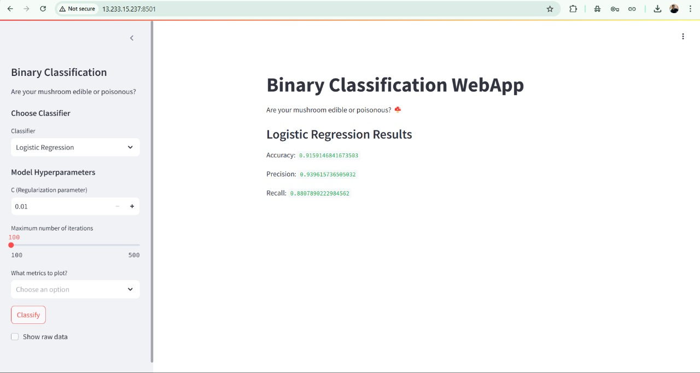

# 🚀 Docker Experiment 8: Deploying a Dockerized Application on AWS EC2  

This guide walks through deploying an application on **AWS EC2** using **Docker**. Follow the steps below to set up the environment, transfer files, build the Docker image, and run the application.  


---

## 📌 Prerequisites  

✔️ **AWS EC2 Instance** (Amazon Linux 2)  
✔️ **SSH Key Pair** (`vs-kp-1.pem`)  
✔️ **Docker Installed** on EC2  
✔️ Required files: `Dockerfile`, `app.py`, `requirements.txt`, `mushrooms.csv`  

---

## 🛠 Deployment Steps  

### 1️⃣ Update the System  
```sh
sudo yum update -y
```

### 2️⃣ Install Docker  
```sh
sudo amazon-linux-extras install docker
```

### 3️⃣ Start the Docker Service  
```sh
sudo service docker start
```

### 4️⃣ Create a Directory for Application Files  
```sh
mkdir downloads
```

### 5️⃣ Transfer Files to EC2  
```sh
chmod 600 vs-kp-1.pem
scp -i vs-kp-1.pem Dockerfile app.py requirements.txt mushrooms.csv ec2-user@13.60.105.49:/home/ec2-user/downloads
```

### 6️⃣ Build the Docker Image  
```sh
sudo docker build -t my_app:v1.0 -f Dockerfile .
```

### 7️⃣ Run the Application in a Container  
```sh
sudo docker run -d -p 8501:8501 my_app:v1.0
```

---

## 🎯 Result  

✅ The application is now deployed and running on your **AWS EC2 instance**!  

📌 **Access it via:**  
```
http://<EC2-Public-IP>:8501
```

🔍 **Check running containers:**  
```sh
sudo docker ps
```

📜 **View container logs:**  
```sh
sudo docker logs <container-id>
```

🛑 **Stop the container:**  
```sh
sudo docker stop <container-id>
```

### 📸 Application Running Screenshot  
  

---

## 📢 Additional Notes  

- Ensure your **EC2 security group** allows inbound traffic on **port 8501**.  
- If needed, restart Docker:  
  ```sh
  sudo service docker restart
  ```  
- If the container stops unexpectedly, check logs for errors.  

🚀 **Happy Deploying!** 🚀  

